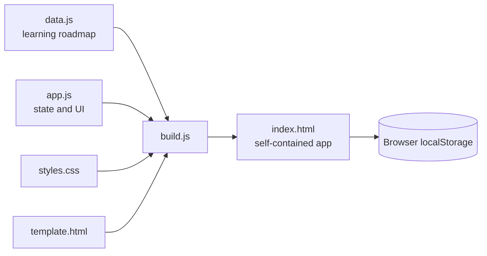

# Developer Skill Tracker

A local-first, mobile-friendly web app for planning and tracking a path into software, backend, cloud, DevOps, and practical AI engineering.

The tracker turns a large learning roadmap into ordered, manageable tasks. It runs as a single static page, stores progress in the browser, and needs no account, backend, build step, or dependency to use.

## Highlights

- 206 ordered skills and project tasks across ten categories
- Four progress states: Not Started, Learning, Practising, and Confident
- Weighted overall and category progress
- “What should I do next?” recommendation based on roadmap order
- Focus Mode that reduces the interface to the next three tasks
- Search, collapsible sections, difficulty labels, notes, and resource links
- Weekly discipline checklist with an independent reset
- JSON export and import for portable backups
- Responsive interface designed for desktop and mobile
- Browser-only persistence with `localStorage`

## Tech stack

| Area | Technology |
| --- | --- |
| Structure | Semantic HTML |
| Styling | Responsive CSS |
| Behaviour | Vanilla JavaScript |
| Persistence | `localStorage` |
| Packaging | Small Node.js build script |
| Deployment | Any static host, including GitHub Pages |

## Architecture



`index.html` is the deployable artifact. The source files remain separated for maintenance, and `build.js` inlines them into one file for simple hosting and offline use.

## Try it locally

### Fastest option

Clone the repository and open `index.html` in a modern browser:

```bash
git clone https://github.com/harrybhatiadevs/Claude-Mobile.git
cd Claude-Mobile
open index.html
```

On Windows, double-click `index.html` or run:

```powershell
start index.html
```

### Local server

Serving the directory avoids stricter `file://` browser behaviour:

```bash
python3 -m http.server 8000
```

Then open [http://localhost:8000](http://localhost:8000).

## Using the tracker

1. Work through categories from top to bottom.
2. Set a task to Learning, Practising, or Confident.
3. Add notes and a useful reference link when needed.
4. Use **What should I do next?** when choosing the next task.
5. Turn on **Focus Mode** to display only the next three incomplete items.
6. Export progress periodically as a JSON backup.

Progress belongs to the current browser and device. Use export/import to move it elsewhere or recover from cleared browser storage.

## Development

The generated `index.html` should not be edited directly.

```bash
# Edit template.html, styles.css, data.js, or app.js
node build.js
```

The build has no package dependencies; it uses Node's standard library.

### File guide

| File | Purpose |
| --- | --- |
| `template.html` | Maintainable page structure |
| `styles.css` | Theme, components, and responsive layout |
| `data.js` | Ordered categories, tasks, and difficulty levels |
| `app.js` | Rendering, state, progress, focus, search, import/export |
| `build.js` | Inlines the source into a deployable HTML file |
| `index.html` | Generated single-file application |
| `PHONE_SETUP.md` | Phone and GitHub Pages setup notes |

## Data model

Saved progress is stored under `skillTracker.v1` and contains a record for each task:

```json
{
  "items": {
    "category-0-item-0": {
      "status": "practising",
      "notes": "Build another small example",
      "link": "https://example.com/resource"
    }
  }
}
```

Task identifiers are currently derived from their category and position. Adding new tasks to the end of a category is safer than inserting them in the middle because positional changes can shift existing saved records.

## Engineering decisions

- **No framework:** the interaction model is small enough for browser APIs and vanilla JavaScript.
- **Local-first storage:** learning notes remain on the user's device and no account is required.
- **Single-file deployment:** the built app is easy to open, share, cache, and host.
- **Weighted status:** partial progress contributes without treating “Learning” as equivalent to “Confident.”
- **Ordered recommendations:** the next-task engine follows the curated roadmap instead of choosing randomly.

## Future improvements

- Stable task IDs that survive roadmap reordering
- Automated browser tests
- Optional installable PWA support
- Accessible drag-free roadmap customisation
- Optional cross-device sync while preserving the local-first mode
